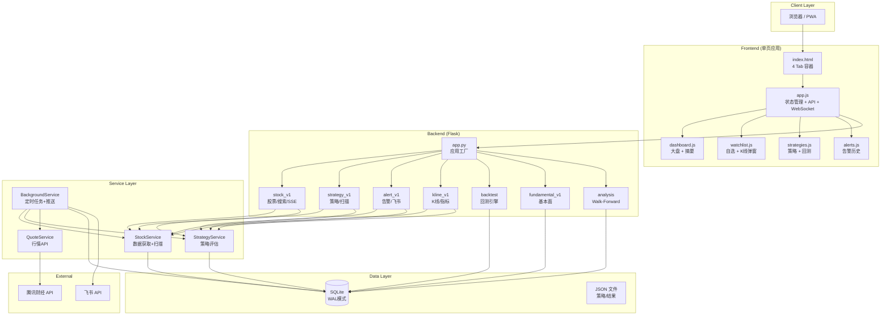

# Architecture Decision Record - 股票盯盘系统

## ADR-001: 前端架构

**决策**: 单页应用（SPA），原生 JS 模块化，无框架
**理由**: 轻量、无构建步骤、移动端性能好
**权衡**: 无虚拟 DOM，手动管理状态，但对本项目规模够用

## ADR-002: 数据库访问

**问题**: `fundamental_routes.py`、`analysis_routes.py`、`alert_routes.py` 使用 raw `sqlite3.connect()` 而非 `DatabaseManager`
**决策**: 统一使用 `DatabaseManager`，消除连接管理分散
**状态**: ✅ 已修复

## ADR-003: API 路由命名

**问题**: v1 和 legacy 路由混用，部分重复
**决策**: 新接口用 `/api/v1/`，保留 legacy 兼容路由指向 v1 实现
**状态**: ✅ 已统一
